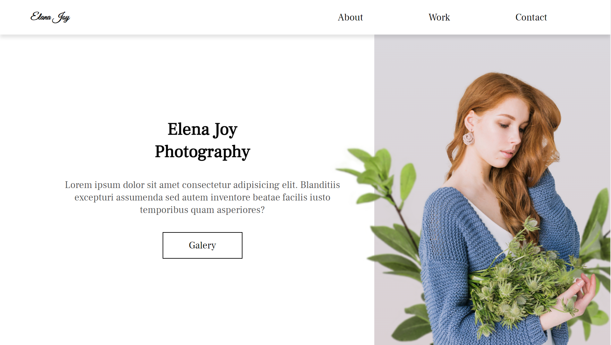
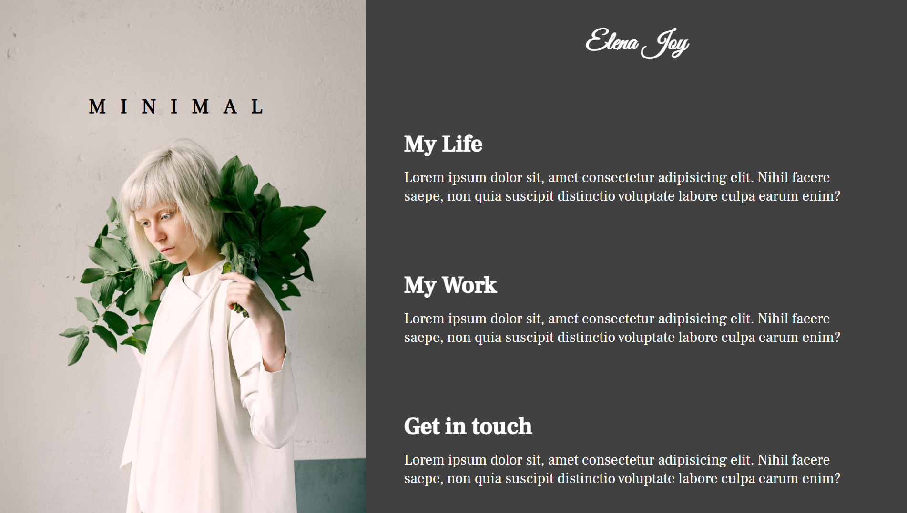

<h1 align="center" style="font-weight: bold;">Elena Joy Photographer </h1>

    <b>Project Description:</b>

This project involves the development of a personal website for photographer Elena Joy. The website will serve as a central hub where visitors can explore Elena’s portfolio, get in touch with her directly, and connect through her social media channels. The goal is to create a user-friendly and visually appealing platform that highlights Elena’s work, facilitates client communication, and enhances her online presence.

This site was created as part of the course "The Creative HTML5 & CSS3 Course - Build Awesome Websites," with the goal of applying and enhancing new skills and techniques in HTML5 and CSS3.

     <a href="https://guithr.github.io/elena-joy/">📱 Visit this Project</a>

<h2 id="layout"> Previews</h2>

    
    
    

<h2 id="technologies">💻 Technologies</h2>

- CSS3
- HTML5
- JAVASCRIPT
